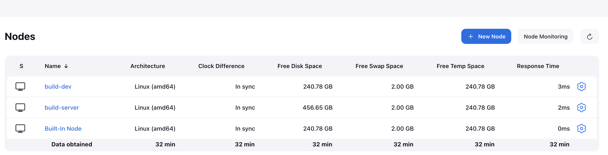
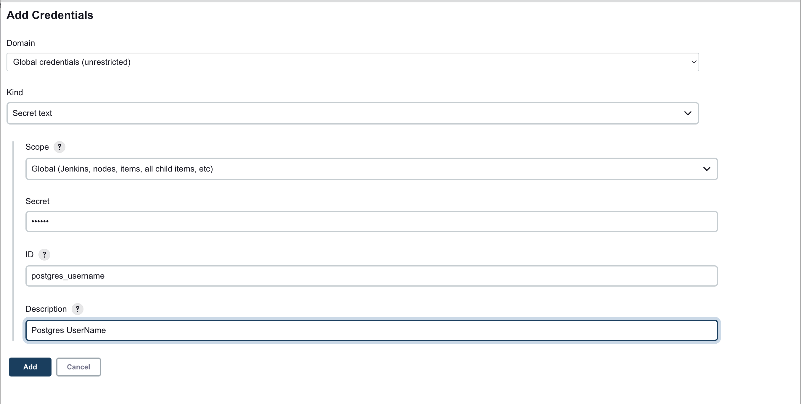
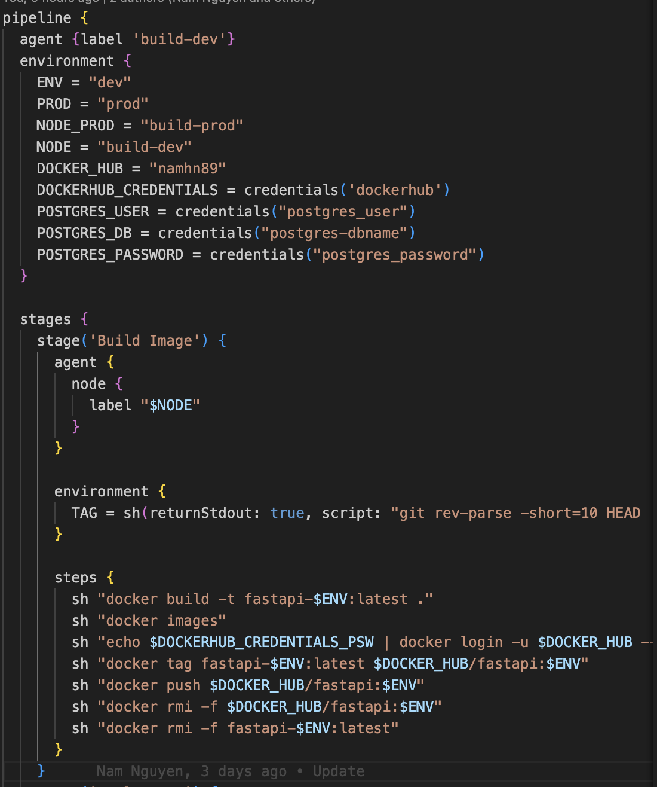
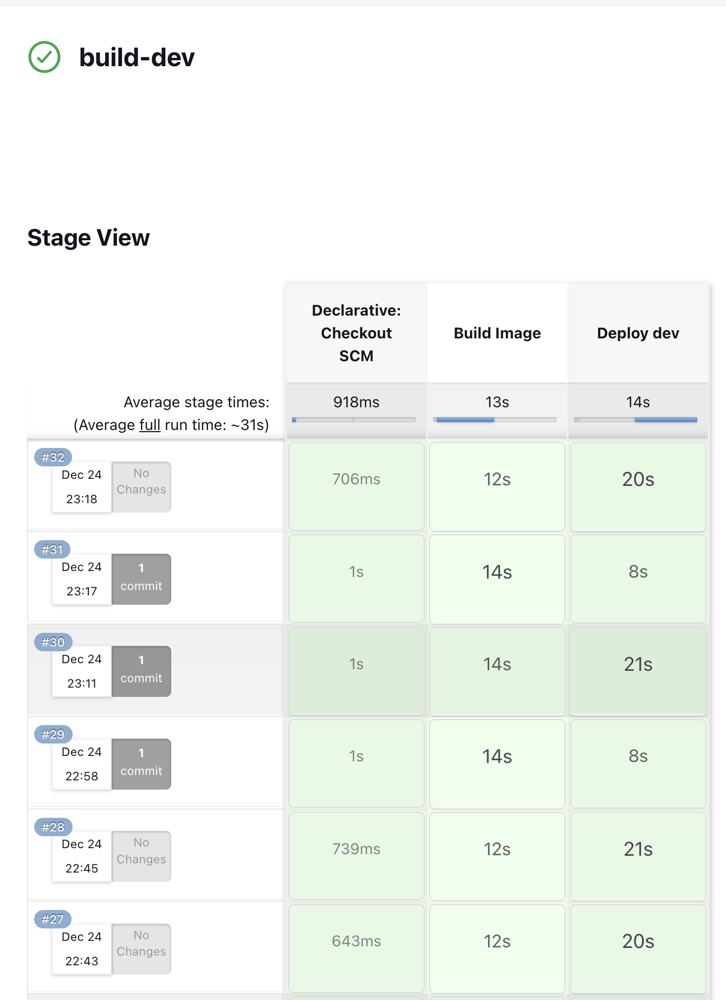

- [DevOps Training Homework 1](#devops-training-homework-1)
  - [Setting up Jenkins](#setting-up-jenkins)
  - [Setup a Jenkins pipeline using a Jenkinsfile.](#setup-a-jenkins-pipeline-using-a-jenkinsfile)
    - [Establish an agent and node to build, deploy services](#establish-an-agent-and-node-to-build-deploy-services)
    - [Credential by secret text, secret password, secret user](#credential-by-secret-text-secret-password-secret-user)
    - [Create a pipeline in Jenkinsfile](#create-a-pipeline-in-jenkinsfile)
  - [Result](#result)
# DevOps Training Homework 1
## Setting up Jenkins
Use a script to deploy jenkins container
```
sh deploy_jenkins.sh
```
Jenkins will ask you for `admin` password. You can retrieve it by running:
```
docker exec Jenkins_Docker cat /var/jenkins_home/secrets/initialAdminPassword
```
## Setup a Jenkins pipeline using a Jenkinsfile.
### Establish an agent and node to build, deploy services
Create an agent to build image and push image to docker registry

### Credential by secret text, secret password, secret user
Secure the project's password, user, environment variables, and database name by utilizing Jenkins credentials (secret file, text, user, password).


### Create a pipeline in Jenkinsfile
To set up a pipeline for building a Python service app, pushing the image to a Docker registry, and deploying the service to a target server, you can create a Jenkinsfile with the necessary stages.


## Result
The outcome of the Jenskin pipeline

